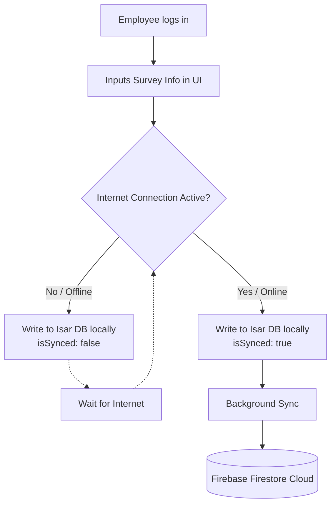

# SevaSutra

## Description
SevaSutra is a profound Healthcare and Demographic Survey Data Collection application designed for on-field personnel, health professionals, and social workers. Its key purpose is to simplify field data gathering (health metrics, socio-economic information) by offering a robust offline-first architecture with seamless backend synchronization. It empowers workers to reliably capture critical community data, even in regions with intermittent or zero internet connectivity.

## Features
- **Offline-First Capabilities:** Employs the fast Isar Database to cache user health and demographic records offline locally on the device.
- **Auto Sync with Cloud:** Synchronizes locally saved offline data with Firebase Firestore seamlessly whenever internet connectivity is restored.
- **Comprehensive Demographics & Health Collection:** Quickly log vital health indicators including BP, Sugar, Hemoglobin, BMI, Pregnancy tracking, along with socioeconomic indices.
- **Field Worker Management:** Dedicated `Employee` schema to track assignments based on district, block, and village parameters.
- **Real-Time Data Visualizations:** Offers dashboards and dynamic charts (using `fl_chart`) for admin and field workers.
- **Authentication & Security:** Fully integrated with Firebase Authentication for controlled access.

## Tech Stack
- **Frontend:** Flutter (Dart)
- **Backend:** Firebase (Firestore, Authentication)
- **Local Storage:** Isar Database (for complex data modeling), Hive (for Key-Value configs)
- **State Management:** Provider
- **Other libraries used:** 
  - `connectivity_plus` (Offline/Online triggers)
  - `image_picker` (Profile and document capture)
  - `fl_chart` (Statistical rendering)

## Architecture
- **UI Layer:** Modulized screens segmented into functional features (e.g., `logins_pages`, `surveys_functions_screen`, `admin_pages`, `bottom_navigatio_bar_screen`). 
- **Business Logic Layer:** State changes managed via the Provide pattern. Event listeners observe connectivity states to execute asynchronous synchronization logic.
- **Data Layer:** Isar serves as the Local Database Repository, executing sub-millisecond offline reads/writes. A sync-engine synchronizes records where `isSynced == false` up to Firebase Firestore securely.

### Data Flow Architecture

Below is the workflow illustrating how data is cached offline and synchronized natively:




## Folder Structure
```text
sevasutra_flutter/
├── android/            # Android-specific native configurations
├── ios/                # iOS-specific native configurations
├── lib/
│   ├── main.dart       # App entry point & initialization
│   ├── firebase_options.dart
│   ├── models/         # Isar Collections (user.dart, employee.dart)
│   └── screens/        # Encapsulated UI Views
│       ├── admin_pages/
│       ├── bottom_navigatio_bar_screen/
│       ├── connectivity/
│       ├── logins_pages/
│       └── surveys_functions_screen/
├── pubspec.yaml        # Flutter project dependencies
└── README.md           # Project Documentation
```

## Installation & Setup

**Step-by-step instructions:**

1. **Clone the repo:**
   ```bash
   git clone https://github.com/Praful2604/SevaSutra.git
   cd sevasutra_flutter
   ```

2. **Install Flutter Dependencies:**
   ```bash
   flutter pub get
   ```

3. **Generate Isar Database Files:**
   Because Isar relies on code generation, ensure you generate the required `.g.dart` files.
   ```bash
   flutter pub run build_runner build --delete-conflicting-outputs
   ```

4. **Setup Firebase Project:**
   - Go to [Firebase Console](https://console.firebase.google.com/) and create a new project.
   - For Android, copy the downloaded `google-services.json` file to the `android/app/` folder.
   - Enable Firebase Authentication and Cloud Firestore within the console.

5. **Run the App:**
   ```bash
   flutter run
   ```

## How to Use
1. **Login:** An authorized field worker logs into the mobile application.
2. **Dashboard / Home:** View connectivity status, synced summary, and new assignments.
3. **Create Record:** Launch a new survey form to enter dynamic beneficiary data logically split across steps (Demographic → Health Readings → Medical History).
4. **Local Tracking:** Submit the form. Notice it displays immediately under "Local Data".
5. **Auto Upload:** Reconnect to a Wi-Fi/Cellular network and wait. All pending submissions will automatically push to Firestore.

## Future Improvements
- **Geotagging:** Implementing GPS coordinates metadata for each health survey.
- **Localization (i18n):** Support for multiple regional languages to cater to a wider user base.
- **Advanced Exporting:** Options to export charts and demographic data into Excel/PDF directly from the Admin screen.

## Author
Praful

---
*Created meticulously to ensure resilient data tracking for better futures.*
